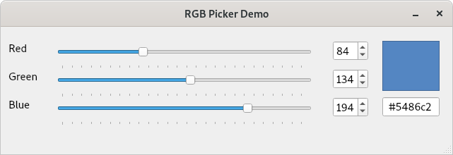

# qt-demos
A small collection of demo applications aimed at Qt beginners or anyone interested in getting started with Qt

- [signals-slots](signals-slots) Basic demo on using signals and slots

    - [rgb-picker-demo](signals-slots/rgb-picker) An RGB colour picker demoing connecting signals and slots between UI widgets (```QSliders```, ```QSpinBoxes```) and customs slots.

    
