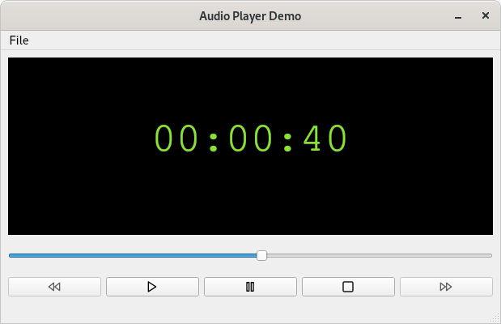

# audio-player
A simple multimedia application demonstrating how to use Qts QMediaPlayer component to playback MP3 files.

Note: If haven't implemented the rewind and fast forward buttons yet and for the sake of keeping
the code to a minimum I haven't included any error handling (for shame!!!)

Credits: The lovely flat icons used in the demo are from https://feathericons.com/
