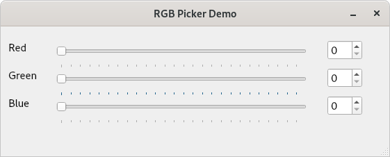
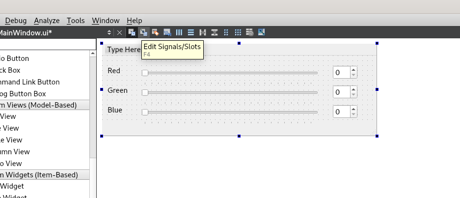
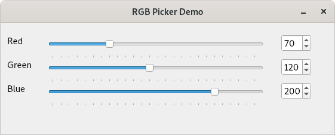

# rgb-picker-demo-2

This is the second step in the rgb-picker-demo. It is based rgb-picker-demo-1
with the addition of a simple UI for the RGB picker interface.

There are no code changes in this step as all changes have been made in Qt Designer. The only user owned
file that should have changed is MainWindow.ui

Using Qt Designer I have created a simple UI for our RGB picker demo:-



There are 3 Qt widgets for each of the colour components

- A "QLabel" for the name of the colour component (e.g "Red", "Green", "Blue")

- A "QSlider" to allow the user to choose the value for each colour component. <br>
  Using the properties editor the min and max values for each QSlider has been set to 0 and 255 respectively.

- A "QSpinBox" to display the chosen value for each colour component. <br>
  Using the propeties editor the min and max values for each QSpinBox has been set to 0 and 255 respectively.

For this step we are going to connect some signals and slots using Qt Designers Signal and Slot Editor.

#### To switch to the Signal & Slot Editor click the second button on the toolbar


Once in signal and slot mode we can make connections between Widgets by dragging with the mouse. We would like the value
of each of the QSpinBox widgets to automatically update when the user changes the corresponding slider value.

To do this we can click on the QSlider we wish to connect and (while the mouse button is held down) drag the mouse pointer
over the widget we would like to connect to (in this case a QSpinBox) and release the mouse.


Once the mouse is released the "Configure Connection" dialog box will open. Qt will display a list of available signals from the source widget (QSlider)
and slots on the target widget (QSpinBox) that we can choose to connect.

**Note:** If any of the entries are greyed out it means that the connection between that signal and slot is not compatible (e.g a signal emmiting a integer value cannot be connected directly to a slot that expects a String value)

When the user changes the value of a QSlider it will emit the "valueChanged" signal with an integer value corresponding to the slider value (in our case this will be in the range 0 -255).
We'd like our QSpinBox widgets to show this value we can connect the signe to its "setValue" slot.


We will make the same connections for each of our QSlider and QSpinBox pairs (red, green, blue) and once this is complete we should see the following connections in Qt Designer.


After each of the signal/slot connections have been completed for each of the RGB pairs we should be able to run the application.



If the steps have been followed correctly you should see the values in each QSpinBox update when its corresponding QSlider is changed.

In this example we used Qt Designer to make simple signal/slot connections. Note that no changes to the code from rgb-picker-demo-2 were required as Qt took care of generating the connections for us.

If you are curious you can take a look at the ```ui_MainWindow.h``` that the Qt Meta Object Compiler generates to see how Qt makes the connections behinds the scenes (We will be using this technique in a later demo to handle more complex connections)

```C++
QObject::connect(sliderRedValue, SIGNAL(valueChanged(int)), spinRedValue, SLOT(setValue(int)));
QObject::connect(sliderGreenValue, SIGNAL(valueChanged(int)), spinGreenValue, SLOT(setValue(int)));
QObject::connect(sliderBlueValue, SIGNAL(valueChanged(int)), spinBlueValue, SLOT(setValue(int)));
```

**Note:** You might notice that when you change the value of a QSpinBox only its value is updated, it would be nice if the slider updated too. We could connect a signal
from the QSpinBox back to the QSlider to fix this in the same way we did above, but I'd like to leave this until the next step so I can demonstrate the second method of connecting
signals and slots.
