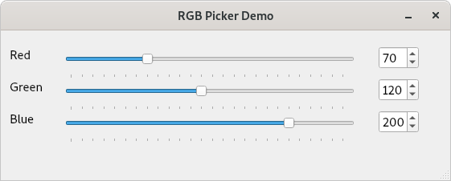

# rgb-picker-demo-3

This is the third step in the rgb-picker-demo. It is based rgb-picker-demo-2
with some additional code demonstrating how to manually connect signals and slots between UI widgets.

In the previous steps we used Qt Designer to build a simple UI and demonstrated how to use the "Signal and Slot Editor" to make connections between UI components<br>
without the need to write any code.



The resulting application allows the user to choose a colour by adjusting the individual sliders for the Red, Green and Blue colour components.

We achieved this by connecting the "valueChanged(int)" signal from each of the QSlider widgets to the "setValue(int)" slot on each QSpinBox.

Since we are using QSpinBox widgets to display the RGB values and they are also input controls it would be nice if the reverse functionality worked, e.g when<br>
when the user changes the value of a QSpinBox using the up/down arrows or entering a value in the textbox then the position of the slider is also changed.

Now, we could achieve this using the Qt Designer "Signal and Slot Editor" as we did in the previous step but I'd like to demonstrate how to make signal/slot connections manually in code.

At the time of writing there are 3 ways (that I am aware of) to make connections directly between Widgets. An example of each method can be seen in the
constructor of our [MainWindow](MainWindow.cpp) class.


```C++
MainWindow::MainWindow(QWidget* parent)
    : QMainWindow(parent),
      ui(new Ui::MainWindow) {          // Create a new instance of out UI template

    ui->setupUi(this);                  // Attach the UI template to our MainWindow

    //
    // Here we manually connect the QSpinBox::valueChanged(int) signal to the QSlider::setValue(int) for
    // each of our RGB components so that the slider position is automatically updated when the value of
    // the QSpinBox changes.
    //

    //
    // Method 1 - The old way
    // This is how signals and slots were connected early on on Qts development. It is still used
    // by the MOC when automatically generating connections from Qt Designer but is no longer the
    // recommended method for user code. It relied on the SIGNAL and SLOT macros to generates method
    // signature strings which are then wired together by the MOC (but in C++ macros are evil)
    //

    connect(ui->spinRedValue, SIGNAL(valueChanged(int)), ui->sliderRedValue, SLOT(setValue(int)));

    // Method 2 - The new and improved C++ way
    // As C++ compilers have evolved signal and slot connections have also evolved. With modern C++
    // we can make connections by references the signal/slot methods on each Widget
    //
    // Note: The QSpinBox::valueChanged signal is overloaded as the spin box can contain numeric or
    // text values so there are both QSpinBox::valueChanged(int) and QSpinBox:valueChanged(const QString&)
    // overloads. In this case we need to tell Qt which one we would like to connect. This is done using
    // The QOverload<>::of() helper method.
    //
    // If the signals and slot do not have any overloads we can ommit this (e.g &QSpingBox::valueChanged) and
    // Qt will figure out the method signature.
    //
    // This probably the preferred method for simple connections.
    //

    connect(ui->spinGreenValue, QOverload<int>::of(&QSpinBox::valueChanged), ui->sliderGreenValue, &QSlider::setValue);

    //
    // Method 3 - The C++ guru way ... with Lambdas
    // Perhaps not the best example here since we just need to set a single value, but image you wanted
    // to do more than just set the value of the Blue QSpinBox e.g perhaps change the blue value of another
    // widgets background colour to reflect the change? Well you could do this inside the lambda too.
    //

    connect(ui->spinBlueValue, QOverload<int>::of(&QSpinBox::valueChanged), ui->sliderBlueValue, [=]() {
        ui->sliderBlueValue->setValue(ui->spinBlueValue->value());

        // Add code here for anything else you'd like to do in response to the QSpinBox:valueChanged signal.
    });

}
```

With the above connections in place we can now run the application and we should see the slider position auto-magically change when we make changed to each of the QSpinBox widgets.
