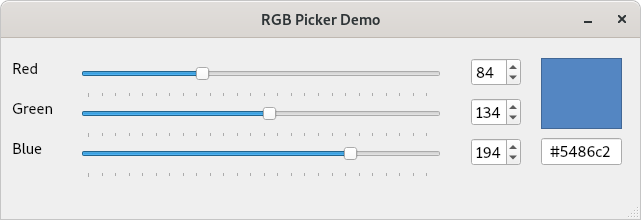

# rgb-picker-demo-3

This is the fourth step in the rgb-picker-demo. It is based rgb-picker-demo-3
with some additional code demonstrating how we can connection signals from one or more ```QObjects``` (QWidgets) to
custom slots on our ```MainWindow``` class.

In the previous step we showed the different ways we can manually make signal/slot connections between UI widgets. But what if we want to do
something a little more complicated. In this example we are going to generate and display the HTML colour code based on the RGB values
selected by the user either via the QSlider or QSpinBox widgets.

And while were at it, why not display the color to the user too?

In Qt Designer I have added two additional widgets:-

- A ```QLineEdit``` to display the HTML colour code (which I have set to read-only)
- A ```QFrame``` to display the actual colour based on the user input



We'd like the HTML colour code (and colour preview) to update when any of the R, G or B values are changed. To achieve this we need to be able to react to
the ```QSlider::valueChanged(int)``` signal of all 3 sliders, but instead of making connections to 3 different slots, we can connect them all to a single custom
slot that we will add to our ```MainWindow``` class

To define a new slot we first need to add it to the MainWindow class in [MainWindow.h](MainWindow.h) as follows: -

```C++
class MainWindow : public QMainWindow {

    Q_OBJECT

public:
    MainWindow(QWidget* parent = nullptr);
    ~MainWindow();

private slots:

    //
    // Here we delare a custom slot on our MainWindow class. This slot will be connected to the
    // "valueChanged()" signal of each of out RGB QSliders so that when any value changes we
    // can do some processing.
    //

    void _onRGBValues_Changed();

private:
    Ui::MainWindow *ui;
};
```

Slots are just regular C++ methods so we need to add the body to the CPP implmentation in [MainWindow.cpp](MainWindow.cpp)

```C++
void MainWindow::_onRGBValues_Changed() {

  // TODO: Calculate the HTML colour code based on user input

}
```
